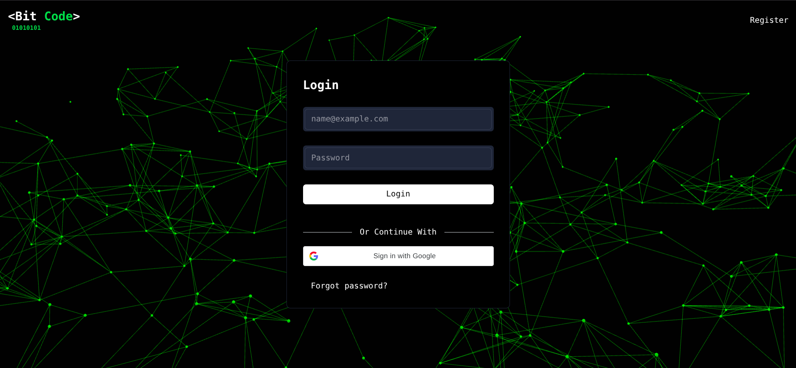
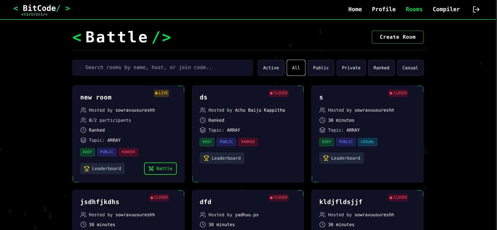
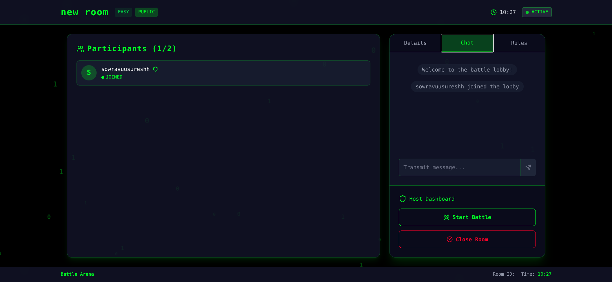
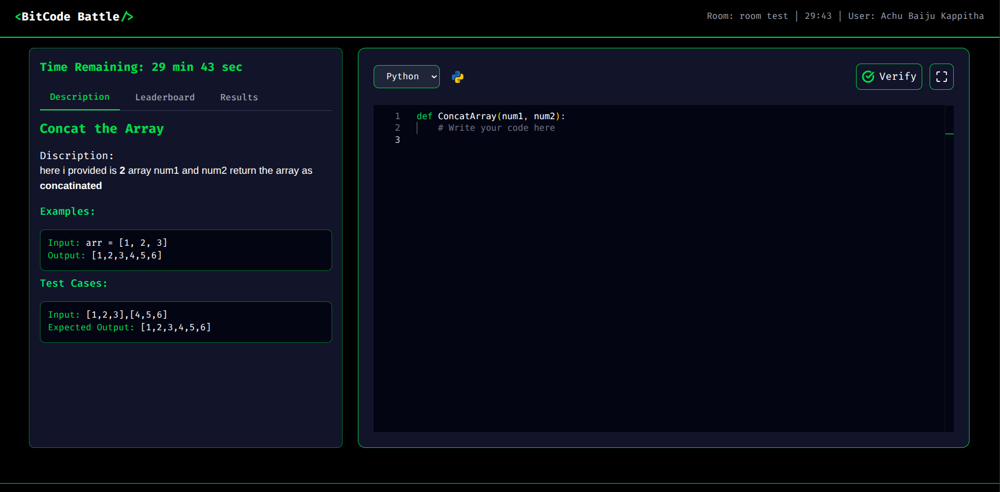
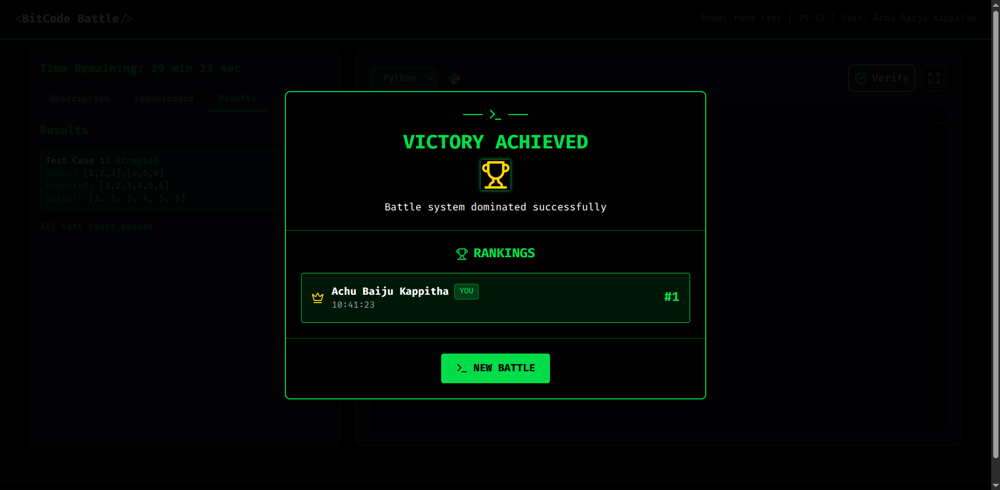

⚔️ BitCode

A real-time competitive coding battle platform built with Django, React, and WebSockets.

🚀 Overview

BitCode is a dynamic, scalable platform designed for real-time competitive programming battles.

Users can:
✅ Join coding lobbies
✅ Compete head-to-head in 1v1, squad, or team battles
✅ Get instant feedback on submissions
✅ Track live leaderboards & rankings

The platform prioritizes speed, reliability, and an engaging user experience, making it perfect for coders to sharpen their skills in a fun environment.

✨ Features

🔴 Real-Time Coding Battles – Head-to-head competitions with instant updates.

⚡ Instant Code Evaluation – Integrated with Judge0 API for fast, accurate execution.

🧑‍🤝‍🧑 Lobby System – Create or join rooms, invite friends, and challenge others.

📊 Live Leaderboard – Rankings update instantly across battle modes.

⏳ Timed Challenges – Test your speed & accuracy under pressure.

👥 Multiple Modes – 1v1 duels, 5-member squads, 10-team battles.

💬 In-Game Chat – Chat with participants during battles.

🔒 Secure Authentication – Email & Google OAuth support.

📱 Responsive UI – Optimized for desktop & mobile.

🖼️ ImageKit Integration – Cloud-hosted media with CDN delivery.

🛠️ Tech Stack
Frontend

⚛️ React.js (with Redux for state management)

🎨 Tailwind CSS + custom styling

🔌 WebSockets for real-time updates

Backend

🐍 Django + Django Channels

🔁 Redis (message broker + caching)

🗄 PostgreSQL (relational database)

⚡ Judge0 API (code execution engine)

🖼 ImageKit (image hosting & CDN)

🌍 Live Demo

👉 bitcode.live

⚙️ Environment Variables

Create a .env file in the frontend and backend with:

# API URLs
VITE_API_BASE_URL=http://127.0.0.1:8000
VITE_FRONTEND_BASE_URL=http://localhost:5173

# Google OAuth
VITE_GOOGLE_CLIENT_ID=your-google-client-id.apps.googleusercontent.com

# Judge0 API
VITE_JUDGE0_API_URL=https://compile.bitcode.live

# ImageKit Configuration
VITE_IMAGEKIT_PUBLIC_KEY=your_public_key
VITE_IMAGEKIT_URL_ENDPOINT=https://ik.imagekit.io/your_endpoint_id
VITE_IMAGEKIT_PRIVATE_KEY=your_private_key

## Screenshots

### Login

### rooms

### Lobby & Chat

### Coding Battle

### Result

